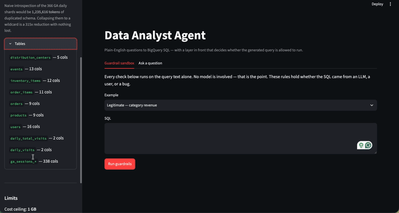

# Data Analyst Agent

Ask a question in plain English, get an answer from BigQuery — with a layer in
front that decides whether the generated SQL is allowed to run at all.



Live: `___` | [How it's wired](docs/architecture.md) | [Things that broke](#things-that-broke)

---

## The problem I wanted to solve

Getting an LLM to write SQL is easy. Every model does it competently now.

The part nobody demos is what happens when it writes something wrong — and
"wrong" has a wide range. It can invent a column that doesn't exist. It can
reach for a table you never meant to expose. It can write a perfectly valid
query that scans six gigabytes because it forgot a date filter. Or it can
write `DROP TABLE` at the end of something that looked fine.

You can ask a model nicely not to do those things. That lowers the rate. It
doesn't bound it.

So this project is the other half: parse every generated query before it runs,
check it against rules that don't depend on the model cooperating, and refuse
the ones that fail. The SQL generation is the boring part. The layer that says
no is the point.

## How it works

The agent turns a question into SQL, then five checks run before anything
touches BigQuery:

1. **Parse it.** Must be a single statement, and it must be a `SELECT`. Checked
   on the syntax tree, not with pattern matching — so `DELETE` buried inside a
   CTE gets caught too.
2. **Check the tables.** Every table reference has to be in the allowlist.
3. **Check the columns.** Every column has to exist in the schema the model was
   shown. A column it invented gets rejected, not executed.
4. **Check the row limit.**
5. **Check the price.** BigQuery can tell you what a query *would* cost without
   running it. If it's over the ceiling, it doesn't run.

If a check fails, the violation goes back to the model and it tries again —
twice, then it stops and tells you why. If everything passes, the query runs
against a row cap and the results get explained in plain English.

Full diagram: [docs/architecture.md](docs/architecture.md).

## The data

Two BigQuery public datasets, both read-only:

- **`thelook_ecommerce`** — a synthetic online store. 7 tables, 75 columns,
  orders and users and products, real joins.
- **`google_analytics_sample`** — real Google Analytics session data. One table
  per day for a year.

That second one is where it got interesting.

## The schema didn't fit, and the reason was dumber than I expected

Google Analytics stores each day as its own table. 366 of them. Every one has
the same 338 columns, and 322 of those are nested paths — things like
`totals.pageviews` and
`trafficSource.adwordsClickInfo.targetingCriteria.boomUserlistId`.

Describing all of that to the model comes to **1,235,616 tokens.**

I expected to solve this with a clever compaction strategy — rank columns by
relevance, keep the important ones, drop the rest. Then I looked at what the
1.2 million tokens actually *was*: the same 338-column schema, written out 366
times.

BigQuery already treats those tables as one thing if you address them with a
wildcard. So I describe one of them and call it `ga_sessions_*`. The whole
corpus went to **3,921 tokens.** 315x smaller, and nothing was lost — the other
365 copies were copies.

I'm keeping the compaction machinery because a real warehouse would need it.
But the honest version of this story is that the big win was noticing
duplication, not the clever part.

## Numbers

### Schema

| | tables | columns | tokens |
|---|---|---|---|
| thelook_ecommerce | 7 | 75 | 488 |
| GA, naive (366 shards) | 366 | 123,708 | 1,235,616 |
| GA, collapsed to wildcard | 1 | 338 | 3,376 |
| **full corpus as sent to the model** | **10** | **417** | **3,921** |

### Cost ceiling

Ceiling is 1 GB. These are dry-run measurements, not estimates:

| query | bytes | result |
|---|---|---|
| `SELECT *` all GA shards, no date filter | 5.767 GB | **blocked** |
| `SELECT *` GA, one month | 0.794 GB | passes |
| `SELECT COUNT(*)` all GA shards | 0.000 GB | passes |
| `SELECT *` thelook.events (2.4M rows) | 0.384 GB | passes |

`COUNT(*)` across all 366 tables costs nothing — BigQuery answers it from
metadata. Which means "touches every table" and "expensive" are different
questions, and a guard that counted tables instead of bytes would block a free
query. Bytes is the right signal.

### Accuracy

Execution accuracy across `___` questions: `___`
Adversarial prompts blocked: `___` / 5
Average retries per question: `___`

Scored by comparing result sets, not SQL strings — two different queries can
both be right, and a string comparison would fail the correct one.

*(Placeholders until the eval run happens. Nothing here is estimated.)*

## Choices I made

**Execution accuracy, not SQL string match.** `___`

**Retries capped at 2.** `___`

**AST parsing instead of a prompt instruction or a regex.** `___`

**How the schema context gets compacted.** `___`

## Things that broke

### The health check broke the moment it had something to report

`/health` was written to never raise — a 500 during a deploy tells you nothing.
It caught `ImportError` for the not-yet-written agent module and reported
`not_implemented` cleanly.

Then the module appeared as a stub that raised `NotImplementedError`, and
`/health` started returning a full traceback. I'd guarded against "file
missing" when the real states were missing, stub, broken, and working. The
endpoint whose entire job was to degrade gracefully was the one that crashed,
because I only ever tested it in the state I wrote it for.

### A guardrail that failed open

Column validation looked up each table's columns from the schema context. If
the lookup came back empty, the code treated that as "I don't know this table"
and skipped the check.

The lookup was broken — wrong data structure, so it came back empty every time.
Which meant column validation silently never ran, and a query selecting a
column that doesn't exist passed all four checks and reported clean.

The bug was a one-liner. The lesson wasn't. A guardrail that skips when it's
confused is worse than one that doesn't exist, because it reports success. Any
check that can't complete has to fail closed.

### `___`

## Try it

```bash
curl -X POST https://___/ask \
  -H 'content-type: application/json' \
  -d '{"question": "which traffic sources drove the most sessions in August 2016?"}'
```

Health check:

```bash
curl https://___/health
```

### Running it locally

```bash
git clone https://github.com/ajinkyawadaskar/data-analyst-agent
cd data-analyst-agent
uv venv --python 3.11 && uv pip install -r requirements-dev.txt
cp .env.example .env     # add your GCP service account + Gemini key
uvicorn src.api:app --reload
```

You need a Google Cloud project with the BigQuery API enabled and a service
account with `BigQuery Job User`. The public datasets are free to read but
queries bill to your project — which is the other reason the cost ceiling
exists.

## A note on how I built this

I used AI assistance for the scaffolding — BigQuery client, schema
introspection, the API layer, deploy config, tests, this README.

I wrote the four files that make the actual decisions by hand: the guardrail
checks, the cost ceiling, the graph wiring, and the eval metric. That split was
set before I started. Every judgment call in this project lives in those four
files, and I wanted to be the one who made them.

## Stack

Python 3.11, BigQuery, sqlglot, LangGraph, Gemini 3.6 Flash, FastAPI, DeepEval,
Streamlit, Railway.
