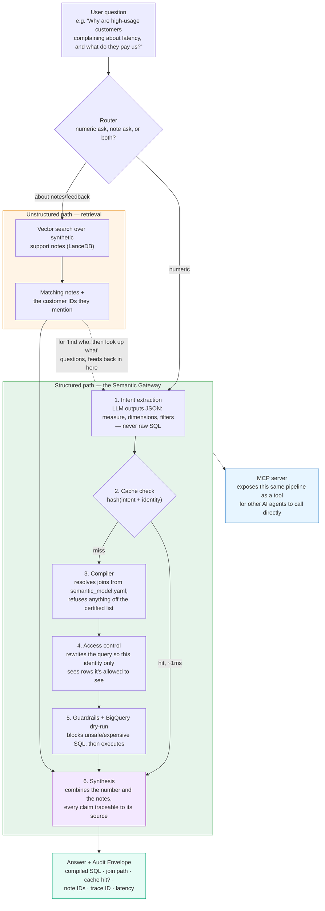

# Guardrailed Natural Language to SQL Agent

Ask a question in plain English, get an answer from BigQuery — with a layer in
front that decides whether the generated SQL is allowed to run at all.


Live: `https://data-analyst-agent-production-316b.up.railway.app` | [How it's wired](docs/architecture.md) | [Things that broke](#things-that-broke)

---

## The problem I wanted to solve

Getting an LLM to write SQL is easy. Every model does it competently now.

The part nobody demos is what happens when it writes something wrong — and
"wrong" has a wide range. It can invent a column that doesn't exist. It can
reach for a table you never meant to expose. It can write a perfectly valid
query that scans six gigabytes because it forgot a date filter. Or it can
write `DROP TABLE` at the end of something that looked fine.

You can ask a model nicely not to do those things. That lowers the rate. It
doesn't bound it.

So this project is the other half: parse every generated query before it runs,
check it against rules that don't depend on the model cooperating, and refuse
the ones that fail. The SQL generation is the boring part. The layer that says
no is the point.

## How it works

The agent turns a question into SQL, then five checks run before anything
touches BigQuery:

1. **Parse it.** Must be a single statement, and it must be a `SELECT`. Checked
   on the syntax tree, not with pattern matching — so `DELETE` buried inside a
   CTE gets caught too.
2. **Check the tables.** Every table reference has to be in the allowlist.
3. **Check the columns.** Every column has to exist in the schema the model was
   shown. A column it invented gets rejected, not executed.
4. **Check the row limit.**
5. **Check the price.** BigQuery can tell you what a query *would* cost without
   running it. If it's over the ceiling, it doesn't run.

If a check fails, the violation goes back to the model and it tries again —
twice, then it stops and tells you why. If everything passes, the query runs
against a row cap and the results get explained in plain English.

Full diagram: [docs/architecture.md](docs/architecture.md).

## The data

Two BigQuery public datasets, both read-only:

- **`thelook_ecommerce`** — a synthetic online store. 7 tables, 75 columns,
  orders and users and products, real joins.
- **`google_analytics_sample`** — real Google Analytics session data. One table
  per day for a year.

That second one is where it got interesting.

## The schema didn't fit, and the reason was dumber than I expected

Google Analytics stores each day as its own table. 366 of them. Every one has
the same 338 columns, and 322 of those are nested paths — things like
`totals.pageviews` and
`trafficSource.adwordsClickInfo.targetingCriteria.boomUserlistId`.

Describing all of that to the model comes to **1,235,616 tokens.**

I expected to solve this with a clever compaction strategy — rank columns by
relevance, keep the important ones, drop the rest. Then I looked at what the
1.2 million tokens actually *was*: the same 338-column schema, written out 366
times.

BigQuery already treats those tables as one thing if you address them with a
wildcard. So I describe one of them and call it `ga_sessions_*`. The whole
corpus went to **3,921 tokens.** 315x smaller, and nothing was lost — the other
365 copies were copies.

I'm keeping the compaction machinery because a real warehouse would need it.
But the honest version of this story is that the big win was noticing
duplication, not the clever part.

## Numbers

### Schema

| | tables | columns | tokens |
|---|---|---|---|
| thelook_ecommerce | 7 | 75 | 488 |
| GA, naive (366 shards) | 366 | 123,708 | 1,235,616 |
| GA, collapsed to wildcard | 1 | 338 | 3,376 |
| **full corpus as sent to the model** | **10** | **417** | **3,921** |

### Cost ceiling

Ceiling is 1 GB. These are dry-run measurements, not estimates:

| query | bytes | result |
|---|---|---|
| `SELECT *` all GA shards, no date filter | 5.767 GB | **blocked** |
| `SELECT *` GA, one month | 0.794 GB | passes |
| `SELECT COUNT(*)` all GA shards | 0.000 GB | passes |
| `SELECT *` thelook.events (2.4M rows) | 0.384 GB | passes |

`COUNT(*)` across all 366 tables costs nothing — BigQuery answers it from
metadata. Which means "touches every table" and "expensive" are different
questions, and a guard that counted tables instead of bytes would block a free
query. Bytes is the right signal.

### Accuracy

Execution accuracy across 25 questions: **8/25 (32%)**
Adversarial prompts blocked: **5/5 (100%)**
Average retries per question: **0.28**

Scored by comparing result sets, not SQL strings — two different queries can
both be right, and a string comparison would fail the correct one.

### I published the wrong number, and blamed the wrong thing

The first version of this section said 20%, and blamed the model: "a
lightweight model that struggles with complex joins." Both halves were wrong,
and I only found out by re-running the evals before building on top of them.

The eval run was committed at 22:11. The commit that fixed column validation
rejecting `ORDER BY <select_alias>` landed at 23:20, 69 minutes later. So the
published number was measured against a guardrail that was falsely rejecting
the agent's own correct SQL. Re-running the identical 25 questions on the
identical model:

| | published (pre-fix) | re-run (post-fix) |
|---|---|---|
| execution accuracy | 5/25 (20%) | **8/25 (32%)** |
| average retries | 0.96 | **0.28** |
| cases returning no rows at all | 11 | **1** |

The last row is the real story. Eleven of the twenty-five questions had been
scored as failures because the agent blocked itself, retried, and gave up. One
still is. Nothing about the model changed between those two columns.

Two honest caveats. Three of the recovered cases now execute but return the
wrong result — the bugfix converted "blocked" into "runs, still wrong," which
is progress but not as much as +12 points suggests. And this is a single run
against a non-deterministic model: one case that passed before (`tl03`) failed
this time while four others started passing, so treat ±1 case as noise.

The lesson is about measurement, not SQL. A guardrail bug and a model
limitation produce the same symptom — no answer — and I attributed the whole
gap to the model without checking. The number that matters for this project is
still the second one: every adversarial prompt was caught, and nothing
dangerous reached BigQuery.

## Choices I made

**Execution accuracy, not SQL string match.** Two different queries can
return the same correct answer — `SUM(sale_price) / COUNT(DISTINCT order_id)`
and `AVG(order_total)` both compute AOV. A string comparison fails the
correct one. So the eval runs both queries against BigQuery and compares the
result sets: same rows, same values (within float tolerance), column names
ignored, order only enforced when the ground truth has an ORDER BY.

**Retries capped at 2.** The first retry usually fixes a syntax error or a
wrong column name — the model gets the error message and corrects it. The
second retry occasionally recovers from a table-structure misunderstanding.
A third almost never helps — by that point the model is stuck on a
fundamental schema misread, and more attempts just burn quota on the same
wrong approach.

**AST parsing instead of a prompt instruction or a regex.** A prompt
instruction ("never write DELETE") reduces the rate of bad SQL. It doesn't
bound it. A regex can be fooled by comments, string literals, or CTEs. An
AST parse with sqlglot sees the actual statement type regardless of how
it's formatted — `DELETE` buried inside a CTE gets caught because the
parser sees a Delete node, not because a pattern matched a string.

**Schema context sent in full.** After collapsing GA's 366 identical daily
shards to one wildcard entry, the entire corpus fits in 3,921 tokens. At
that size, compaction would throw away information for no benefit — the
model sees every table and column, so it can't hallucinate a table that
doesn't exist without the column-validation guardrail catching it.

## Things that broke

### The health check broke the moment it had something to report

`/health` was written to never raise — a 500 during a deploy tells you nothing.
It caught `ImportError` for the not-yet-written agent module and reported
`not_implemented` cleanly.

Then the module appeared as a stub that raised `NotImplementedError`, and
`/health` started returning a full traceback. I'd guarded against "file
missing" when the real states were missing, stub, broken, and working. The
endpoint whose entire job was to degrade gracefully was the one that crashed,
because I only ever tested it in the state I wrote it for.

### A guardrail that failed open

Column validation looked up each table's columns from the schema context. If
the lookup came back empty, the code treated that as "I don't know this table"
and skipped the check.

The lookup was broken — wrong data structure, so it came back empty every time.
Which meant column validation silently never ran, and a query selecting a
column that doesn't exist passed all four checks and reported clean.

The bug was a one-liner. The lesson wasn't. A guardrail that skips when it's
confused is worse than one that doesn't exist, because it reports success. Any
check that can't complete has to fail closed.

### Gemini's response format changed between versions

`response.content` returns a string on older Gemini models. On Gemini 3.x it
returns a list of content parts. The LangGraph nodes called `.strip()` on it
and got `AttributeError: 'list' object has no attribute 'strip'`. The fix
was switching to `response.text`, which is a property that extracts the text
regardless of version — but the error only appeared at runtime, not during
import or type checking.

## Try it

```bash
curl -X POST https://data-analyst-agent-production-316b.up.railway.app/ask \
  -H 'content-type: application/json' \
  -d '{"question": "which traffic sources drove the most sessions in August 2016?"}'
```

Health check:

```bash
curl https://data-analyst-agent-production-316b.up.railway.app/health
```

### Running it locally

```bash
git clone https://github.com/ajinkyawadaskar/data-analyst-agent
cd data-analyst-agent
uv venv --python 3.11 && uv pip install -r requirements-dev.txt
cp .env.example .env     # add your GCP service account + Gemini key
uvicorn src.api:app --reload
```

You need a Google Cloud project with the BigQuery API enabled and a service
account with `BigQuery Job User`. The public datasets are free to read but
queries bill to your project — which is the other reason the cost ceiling
exists.

## A note on how I built this

I used AI assistance for the scaffolding — BigQuery client, schema
introspection, the API layer, deploy config, tests, this README.

I wrote the four files that make the actual decisions by hand: the guardrail
checks, the cost ceiling, the graph wiring, and the eval metric. That split was
set before I started. Every judgment call in this project lives in those four
files, and I wanted to be the one who made them.

## Stack

Python 3.11, BigQuery, sqlglot, LangGraph, Gemini 3.1 Flash Lite, FastAPI,
DeepEval, Streamlit, Railway.

## Semantic Execution Gateway (`feature/semantic-gateway`, complete)

The agent above works by letting the LLM write SQL and then checking it
afterward. That catches a lot, but the model still has to correctly guess
column names, join paths, and metric formulas from a compacted schema every
single time — and a plausible-looking wrong query can slip through a
guardrail that was never designed to know what "correct" means, only what's
*safe*.

This branch removes that guesswork instead of just policing it. The LLM
stops writing SQL entirely. It picks a metric off a small, approved list —
"total revenue," "conversion rate," and so on — and separate, deterministic
code turns that choice into the actual query. Ask for something that isn't
on the list and the request is refused before it ever reaches the database,
instead of running and quietly returning a wrong-but-plausible number.



Every box above is also wrapped in tracing (OpenTelemetry → Langfuse) — not
drawn as its own step because it isn't one path through the system, it's a
layer running underneath all of them.

### What each piece is actually for

**1. A compiler instead of a smarter prompt.** `semantic_model.yaml`
declares every metric, dimension, and join this system is allowed to
compute — nothing else exists as far as the LLM's answer is concerned. The
model's only job is to name which certified metric a question is asking
for; a separate compiler turns that into real SQL using proper query
building (never pasting values into a string). Ask for something outside
the list and it fails to compile, loudly, instead of quietly making
something up. Cost of this: two questions in the original eval set need a
kind of query this model doesn't support, so those two fall back to the
old "let the LLM write SQL" path — reported honestly below, not hidden.

**2. Access control the model can't talk its way around.** A request can
carry an identity (which tenant, which region). Before the query runs, that
identity's allowed access is written directly into the query itself, after
the model is done and can't influence it. An identity with no valid access
is refused outright — never given an empty result that looks like a real
answer of zero.

**3. One tool, exposed the standard way.** The whole pipeline is also
wrapped as an MCP server, so any MCP-speaking AI tool (Claude Code, Cursor,
etc.) can call it directly instead of needing a bespoke integration. Tested
by actually connecting a real MCP client to it, not just calling the
Python function.

**4. A cache that understands meaning, not exact wording.** "Show revenue
by region" and "what's our regional revenue" are the same request. The
cache key is a hash of the *resolved* metric request (plus the identity
asking), not the raw sentence, so both phrasings hit the same cached
answer. Rows are cached, not just the SQL, which is what actually makes the
second answer fast.

**5. Finding "who," then computing "what."** Some questions need both a
qualitative read and a real number — *"why are our top customers
complaining, and what do they pay us?"* First, a search over support notes
finds which customers the complaint is about. Then that exact list of
customer IDs is handed to the compiler as a filter — not left to the model
to decide who counts, since that's exactly the kind of judgment call this
whole system exists to take out of the model's hands.

**6. Proof, not just an answer.** Every response comes back with an audit
trail attached: the exact SQL that ran, the join path it took, whether it
came from cache, which notes it cited, and how long it took. And every step
of a request — routing, compiling, the security rewrite, cache, execution —
is traced end-to-end and viewable afterward.

### The numbers

Same 25 questions, same model, before and after:

| | before (LLM writes SQL) | after (LLM picks a metric) |
|---|---|---|
| Got the right answer | 8/25 (32%) | 12/25 (48%) |
| Could even attempt it | n/a | 23/25 |
| Bad/dangerous queries blocked | 5/5 | 5/5 |

A second, harder set of 18 questions — built specifically to test access
control, caching, and the "find who, then compute what" pattern — passed
**17/18**. The one miss was the model itself doing something slightly wrong
mid-run, not a bug in the system, and it's written up honestly rather than
swept under the rug. Full breakdown, including the bugs this testing
actually caught and fixed: [docs/semantic-gateway.md](docs/semantic-gateway.md).

### Two things worth saying plainly

- The support notes used for the "find who" feature are entirely made
  up — generated from templates, not real customer data. Said in three
  places: the data file itself, the code that generates it, and here.
- The identity behind access control is simulated too. There's no real
  login system — it's a stand-in that proves the access-control mechanism
  genuinely works, not a claim of real multi-tenancy.

Still sits behind a feature flag; the agent above is untouched and still
live. Merging this into the main version is a separate decision, not made yet.
