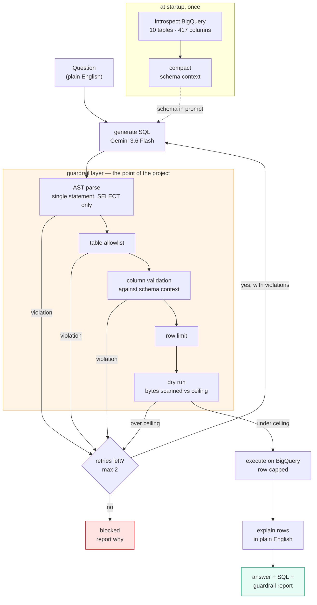

# How it's wired

## Why the order matters

**Parse before you spend.** The AST checks are free and local. The dry run is a
network call to BigQuery that costs latency and fails on invalid SQL. Running
guardrails first means a malformed query is caught by the parser with a useful
message, instead of coming back as a BigQuery 400 that says nothing about
which rule was broken.

**Nothing unguarded reaches BigQuery.** There is no path from `generate_sql`
to `execute` that skips the guard block. That is the entire premise — the
retry loop feeds back into generation, never forward into execution.

**Introspection happens once, not per question.** Reading the schema is ~10
API calls and the schema does not change between questions.

## The schema problem

`google_analytics_sample` stores one table per day — 366 of them, every one
with the same 338 columns. Introspecting them all produces **1,235,616
tokens** of almost entirely duplicated schema.

BigQuery already addresses those shards as one thing via a wildcard
(`ga_sessions_*`), so the fix is to introspect one shard and treat it as one
table. Full corpus drops to **3,921 tokens** — a 315x reduction, with nothing
lost, because the other 365 descriptions were copies.

Worth being precise about what that means: the first and largest win came from
noticing the schema was duplicated, not from a clever compaction rule.
Compaction is the second-order problem.

## Cost ceiling, measured

| query | bytes scanned | vs 1 GB ceiling |
|---|---|---|
| `SELECT *` across all 366 GA shards, no date filter | 5.767 GB | **blocked** |
| `SELECT *` GA, one month | 0.794 GB | passes |
| `SELECT COUNT(*)` across all 366 shards | 0.000 GB | passes |
| `SELECT *` thelook.events (2.4M rows) | 0.384 GB | passes |
| thelook category count | 0.00036 GB | passes |

`COUNT(*)` across every shard is free — BigQuery answers it from table
metadata. So "touches a lot of tables" and "expensive" are different things,
and a guard that counted shards instead of bytes would block a query that
costs nothing.
