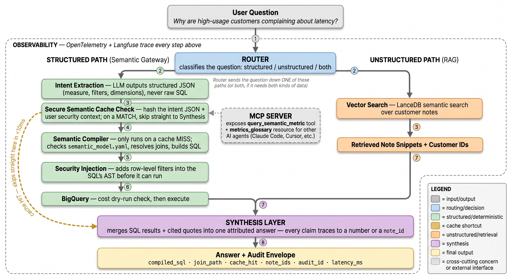

# The Semantic Execution Gateway

`main`'s agent (see [architecture.md](architecture.md)) has the LLM write SQL
directly, then guards what comes back. This build, on `feature/semantic-gateway`,
replaces that with a compiled path: the LLM emits a small structured **Intent**
naming a certified measure/dimension, a deterministic compiler turns that into
SQL, and the result still passes through the same guardrails as `main` before
touching BigQuery. A hallucinated metric becomes a name that doesn't resolve,
not SQL that runs and returns something plausible-looking and wrong.

Six layers, built one at a time over five days, each with its own Definition
of Done. `main` is untouched behind `USE_SEMANTIC_GATEWAY`; every claim below
was measured against real BigQuery and a real Gemini model, not asserted.

The diagram shows the happy path end to end: the router splits a question
into the structured (compiled) path and/or the unstructured (retrieval)
path, both converge on synthesis, and every step in between is traced
(the dashed "Observability" boundary — OpenTelemetry spans exported to
Langfuse). Two things it simplifies for readability, worth knowing:

- **Denial and refusal paths aren't drawn.** Security Injection can refuse
  outright (`SecurityContextError`, Layer 2's DoD case) and the Compiler
  can refuse an off-model measure and fall back to `main`'s own
  `generate_sql` — both real, both tested, neither shown above to keep the
  happy path legible.
- **The MCP Server box is a second entry point into the structured path**
  (same intent → compile → security → guard → execute chain the router
  drives), not something downstream of retrieval.

## The six layers, and what each one is actually for

### Layer 1 — Compiled queries (`src/compiler/intent_compiler.py`)

The LLM never writes SQL on this path. It emits `Intent` JSON (`measure`,
`dimensions`, `filters`) validated against `semantic_model.yaml` — the
certified glossary of what this system can compute. `intent_compiler.py`
resolves the join path by graph traversal and builds the query with sqlglot
expression builders, never string concatenation. Ask for something outside
the model (`avg order value`, which needs a grouped subquery this model
deliberately doesn't express) and the intent extractor marks it
`unsupported`, and the run falls back to `main`'s own `generate_sql` — a
measured fallback, not a silent one.

### Layer 2 — Compile-time security (`src/compiler/security.py`)

`on_behalf_of: {tenant_id, region}` is a **simulated** identity — there are
no real multi-tenant users behind this public dataset — but the mechanism is
real: `inject_security_context` walks the compiled AST for tables carrying a
row policy and ANDs a `country IN (...)` predicate onto whatever `WHERE`
already exists, after the LLM is done contributing anything. An identity
with no resolvable region raises `SecurityContextError` outright — denied,
never a query that quietly returns zero rows and looks like a valid answer.

**Scope limitation, found and kept rather than hidden:** row policies are
opt-in per entity. A question whose compiled query never touches a
policy-guarded table (`users`, `ga_sessions`) is not restricted by anything
here, regardless of whether the identity is valid — and a question the
compiler can't express at all falls back to `main`'s legacy path, which has
no concept of `principal` whatsoever. "Identity-based access control" on
this build means *on the compiled path, for queries that touch a guarded
entity* — not everywhere, and that's a claim worth being precise about
rather than rounding up.

### Layer 3 — MCP (`mcp_server/`)

`semantic://metrics_glossary` is a read-only Resource exposing the certified
measures/dimensions/joins; `query_semantic_metric` is the one tool, wired
through the same intent → compile → security → guard → execute pipeline as
the REST path. Verified from a real MCP client, not just as a Python call
(the DoD is explicit that the latter doesn't count): a real question, the
same question with an identity attached (the AMER allowlist showed up
correctly in the compiled `WHERE`), and a genuinely unsupported question
came back as a clean `ToolError` naming why, not a crash.

### Layer 4 — Semantic cache (`src/cache/`)

The cache key is `SHA-256(compiled Intent JSON, principal)` — post-validation,
pre-SQL — so two differently-phrased, semantically-identical questions hit
the same entry, and two identities never share a filtered result. Rows are
cached, not just SQL, or there's no latency win to show:

| | via the API path | via the MCP tool |
|---|---|---|
| Cold (cache miss) | 3856 ms | 5468 ms |
| Paraphrase (cache hit) | 1003 ms | 599 ms |
| Reduction | 74% | 89% |
| Raw cache read | 0.197 ms (shared) | |

### Layer 5 — Stacking (`src/router.py`, `src/stacking.py`, `src/synthesis.py`)

Three routes: `structured` (numeric, gateway alone), `unstructured` (note
content, retrieval alone), `stack` (needs both — find WHO from a fuzzy
description via retrieval, then compile a precise query scoped to exactly
those `user_id`s). The user-scoping is deterministic and code-controlled: the
LLM extracts *what to compute* from the question, and the code — not the
model — appends `Filter(field="user_id", operator="in", value=user_ids)`
after retrieval already resolved who. Getting the LLM to accept that split
took three prompt iterations; what worked was forbidding the wrong reasoning
path explicitly ("do NOT say `unsupported` because the accounts aren't
identifiable to you"), not just describing the right one.

`src/router.py`'s classifier is rule-based regex over question shape, not an
LLM call — free, instant, and every decision traces to the exact pattern
that fired. Its blind spot is exactly what you'd expect from a keyword
classifier: a real stacking case (`k02` in the golden set) originally read
"customers who **had trouble** authenticating" and silently routed
`structured`, dropping the qualitative half entirely, because "trouble"
isn't one of the unstructured trigger words (`complain`, `issue`, `mention`,
...). Rewording to "**complained** about billing" fixed it. Logged rather
than smoothed over, because a routing miss here is the confidently-wrong-
shaped failure this whole layer exists to prevent.

The synthetic support-notes corpus (`data/synthetic_notes.jsonl`, 180 notes)
is generated by `tools/generate_notes.py` from fixed templates and a seeded
RNG — zero LLM calls, zero real customer data, reproducible byte-for-byte.
Disclosed in three places: the JSONL's own header, the generator's
docstring, and the README.

### Layer 6 — Observability, audit, evals (`src/tracing.py`, `AuditEnvelope`, golden set)

Plain OTel SDK exported via OTLP HTTP to Langfuse Cloud, not a vendor SDK —
swapping backends is a config change. `init_tracing()` with no keys
configured is a documented no-op: spans are still created, just not
exported, matching `/health`'s own fail-open philosophy. Verified two ways,
not one: `exporter.export(spans)` returned `SpanExportResult.SUCCESS`
directly, and the resulting trace was independently confirmed visible in the
Langfuse dashboard.

`AuditEnvelope` is the trust receipt attached to every response — it copies
forward what each layer already decided (`compiled_sql`, `proven_join_path`,
`cache_hit`, `retrieved_note_ids`, `route_taken`) rather than re-deriving any
of it, so a caller never has to take "trust me" as the only option.

## Numbers

**The existing 25-question eval set, both paths, same model
(gemini-3.1-flash-lite), corrected baseline:**

| | legacy (`main`) | semantic gateway |
|---|---|---|
| Answer accuracy | 8/25 (32%) | 12/25 (48%) |
| Coverage (expressible by the model) | n/a | 23/25 |
| Accuracy on covered | n/a | 11/23 |
| Adversarial blocked | 5/5 (100%) | 5/5 (100%) |
| Fell back to legacy | n/a | tl02, tl17 (both need a grouped subquery, deliberately unmodeled) |

Coverage and accuracy are reported separately and never merged — merging
them would either punish the compiler for questions it deliberately doesn't
model, or hide those questions entirely. **+16 points is a real, measured
lift, not a fabricated one**: the baseline itself was re-measured first (see
"What didn't work" below) specifically so this delta isn't accidentally
crediting the gateway for a guardrail bugfix that predates it.

**The golden eval set (`evals/golden_cases.json`, 18 cases covering the four
capabilities the original 25 were never designed to test):**

| kind | result |
|---|---|
| structured (new certified measures/dimensions) | 9/9 |
| permission_denied (invalid region raises; valid-region cross-filter compiles to a structurally empty result) | 4/4 |
| cache_hit_repeat (paraphrase hits the same entry) | 2/2 |
| stack (router + retrieval + compile + synthesis, end to end) | 2/3 |

**17/18.** The one failure (`k03`) is a genuine, kept finding: the LLM's own
intent-extraction step emitted a malformed filter despite the stacking
prompt explicitly forbidding it from adding its own account-identifying
filter — a real model-behavior edge case, not a script bug.

## What didn't work (kept, not smoothed over)

- **A security-correct denial that crashed instead of returning empty.**
  `conversion_rate_pct`, `bounce_rate_pct`, and `returned_order_pct` used raw
  `COUNTIF(...) / COUNT(*)` division. When Layer 2's predicate legitimately
  zeroed out the matching rows (exactly what "structurally unsatisfiable" is
  supposed to look like), BigQuery raised `division by zero: 0/0` instead of
  returning `NULL`. Found by the golden set's own `p03` case; fixed by
  switching all three to `SAFE_DIVIDE`.
- **Two `give_up` exits skipped the audit trail entirely.** `graph_semantic.py`'s
  routing sent a compile-stage refusal (including every Layer 2 denial) and
  an extract-stage retry-exhaustion straight to `END`, bypassing the `_halt`
  node whose entire job is stamping `halt_reason` — so a denied request had
  no recorded reason for stopping, while a guard- or execute-stage failure
  did. Fixed by routing both through `halt` like every other terminal state.
- **The golden set's own first draft cited a note category that doesn't
  exist** (`sso`) and expected-SQL table names that were never real
  (`proj.dataset.orders`) — caught before burning eval quota on cases
  destined to fail for a data-availability reason, not a capability one.
- **Layer 2's guarantee is conditional on the query touching a guarded
  table** — see Layer 2's section above. Not a bug; a scope worth stating
  plainly rather than letting "row-level security" imply more than it does.

See [LEARNING.md](../LEARNING.md) for the full day-by-day narrative (46
numbered concepts) and [NOTES.md](../NOTES.md) for the condensed
decision log.
